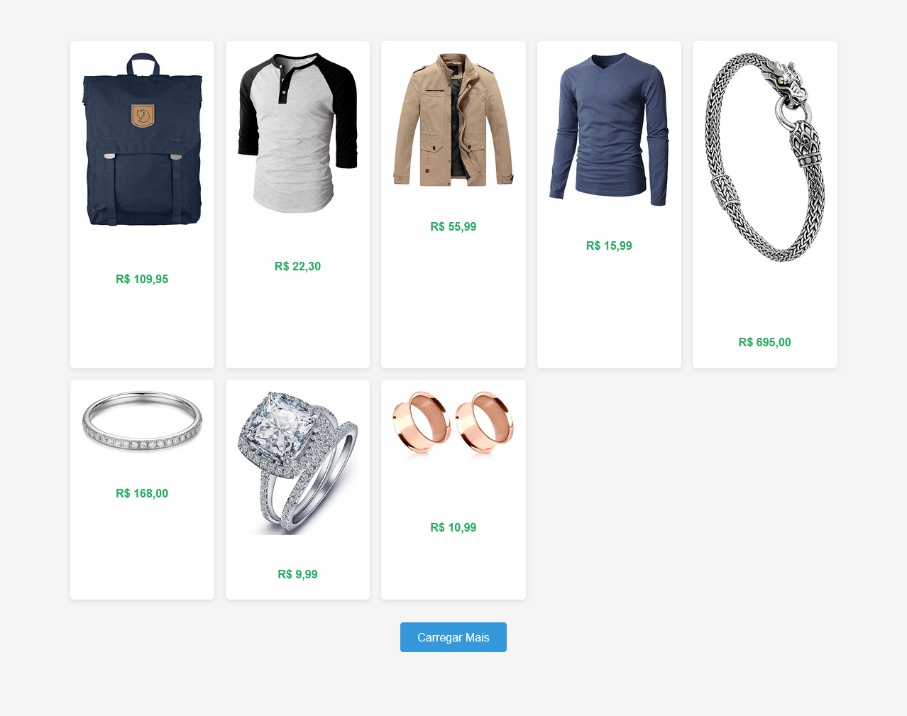

# Roteiro de Prática: Projeto Final InfoCom v1 – Catálogo de Produtos com React

**Objetivo:** Implementar a primeira versão do projeto final da disciplina ([projeto InfoCom](https://www.figma.com/design/imI9f8rVfuUeOkg7ci7LLq/Infonet-Commerce?node-id=0-1&t=qqk08GGArCvWJzg4-1&authuser=1)), com um grid de cards de produto (imagem + preço) com um botão "Carregar Mais", exatamente como no mockup abaixo, usando React.



---

## 1. Criação do projeto

```bash
npm create vite@latest infocom-react
cd infocom-react
npm install
npm run dev   # hot-reload em http://localhost:5173
```

- Limpe o _boilerplate_ e prepare a estrutura básica:
    - Apague o conteúdo do `App.css` e do `index.css`
    - Deixe `App.jsx` retornando apenas `<h1>Catálogo de Produtos</h1>`, dentro de um elemento `<main>`, para confirmar que tudo funciona.
    - Remova os imports não usados em `App.jsx`.
    - No arquivo `index.html`, altere o idioma da página para pt-BR e o título para "InfoCom".
    - Crie uma pasta `components` dentro da pasta `src` para armazenar os arquivos dos componentes do projeto.

---

## 2. Busca dos dados dos produtos na API FakeStore

### No arquivo `App.jsx`:

- Dentro da função `App()`, antes do bloco do `return`, vamos definir um estado para armazenar a lista de produtos retornada pela [API FakeStore](https://fakestoreapi.com/), um estado para uma indicação de erro e outro estado para uma indicação de carregamento de dados:

  ```js
  const [products, setProducts] = useState(null);
  const [loading, setLoading] = useState(true);
  const [error, setError] = useState(null);
  ```
  - Aqui usamos o hook `useState` do React, que nos permite definir um estado para nosso componente, além de uma função para modificá-lo (`setProducts`, por exemplo).
  - ⚠️ _Não esqueça de importar, no topo do arquivo, o `useState` e o `useEffect`, que vamos usar a seguir._

    ```js
    import { useState, useEffect } from "react";
    ```

- Ainda dentro da função `App()`, antes do bloco do `return`, vamos usar o hook do React `useEffect` para definir uma função que será executada na primeira renderização do componente. 

  ```js
  // Fetch dos produtos
  useEffect(() => {
    fetch("https://fakestoreapi.com/products")
      .then((res) => res.json())
      .then(setProducts)
      .catch(() => setError("Erro ao carregar produtos."))
      .finally(() => setLoading(false));
  }, []);
  ```
  - Essa função irá enviar a requisição à API, converter a resposta para JSON e atualizar nosso estado `products`.
  - Além disso, também capturamos os erros que podem acontecer (atualizando o estado `erro`) e gerenciamos o estado de carregamento (`loading`).
  - Aqui, passamos um array vazio como segundo argumento do `useEffect`, o que significa que essa função será executada apenas uma vez, quando o componente for montado.

---

## 3. Componente `<ProductCard>` – card individual

1. **Crie** `src/components/ProductCard.jsx`.
2. **Adicione** o código abaixo — repare no `alt`, na formatação pt-BR do preço e na importação do CSS:

```jsx
import './ProductCard.css';

function ProductCard({ product }) {
  return (
    <div className="card">
      
      <h3>{product.title}</h3>
      <div className="price">
        R$ {product.price.toFixed(2).replace('.', ',')}
      </div>
    </div>
  );
}

export default ProductCard;
```

3. Crie `src/components/ProductCard.css` com o estilo base:

```css
.card {
  background: #fff;
  border-radius: 6px;
  box-shadow: 0 2px 6px rgba(0, 0, 0, 0.1);
  padding: 1rem;
  display: flex;
  flex-direction: column;
  align-items: center;
}

.card img {
  max-width: 100%;
  height: 200px;
  object-fit: contain;
  margin-bottom: .5rem;
}

.card h3 {
  font-size: .8rem;
  margin: .5rem 0;
  text-align: center;
}

.card .price {
  color: #27ae60;
  font-weight: bold;
}
```


> **Teste rápido:** 
> - No `App.jsx`, renderize `<ProductCard product={products[0]} />` para ver o primeiro card enquanto ainda desenvolve:
> ```jsx
> ...
> return (
>   <main>
>     <h1>Catálogo de Produtos</h1>
>     {products && <ProductCard product={products[0]} />}
>   </main>
> );
> ...
> ```
> - ***📝 Explicação:*** O `products &&` é uma verificação para garantir que `products` não seja `null` antes de tentar acessar `products[0]`, evitando erros de renderização. Se for `null`, o React não tentará renderizar o componente `ProductCard`. Chamamos isso de ***"renderização condicional"***.
> - Se tudo der certo, você verá o card do primeiro produto da lista.

---

## 4. Componente `<ProductList>` – grid responsivo

1. **Crie** `src/components/ProductList.jsx`:

  ```jsx
  import ProductCard from './ProductCard';
  import './ProductList.css';

  function ProductList({ products }) {
    return (
      <div className="grid">
        {products.map((prod) => (
          <ProductCard key={prod.id} product={prod} />
        ))}
      </div>
    );
  }

  export default ProductList;
  ```
  
  > O componente `ProductList` recebe uma lista de produtos como prop (`products`), onde percorremos com o método `map()` para criar cada card de produto (componente `ProductCard`)


2. **Estilo** em `src/components/ProductList.css`:

```css
.grid {
  display: grid;
  gap: 1rem;
  grid-template-columns: repeat(auto-fill, minmax(200px, 1fr));
}
```

---

## 5. Componente reutilizável `<Button>`

1. **Crie** `src/components/Button.jsx`:

```jsx
import './Button.css';

function Button({ children, ...props }) {
  return (
    <button className="btn-default" {...props}>
      {children}
    </button>
  );
}

export default Button;
```
> O `children` é uma propriedade especial que referencia o elemento que passarmos como filho desse componente `Button` (mais na frente vocês vão entender).


2. **Crie** `src/components/Button.css`:

```css
.btn-default {
  display: block;
  margin: 2rem auto;
  padding: .75rem 1.5rem;
  font-size: 1rem;
  border: none;
  border-radius: 4px;
  background: #3498db;
  color: #fff;
  cursor: pointer;
}

.btn-default:hover {
  background: #2980b9;
}

.btn-default:disabled {
  background: #bdc3c7;
  cursor: not-allowed;
}
```

> O componente fica genérico para ser reutilizado em outras telas.

---

## 6. Componente **App.jsx** – Montando tudo junto

> Aqui você reúne tudo o que foi criado nos passos anteriores (fetch + cards + grid + botão) e adiciona a lógica de “Carregar Mais”.

---

### 6.1 Importações

1. Abra `src/App.jsx`.
2. Troque o bloco de imports por:

```jsx
import { useEffect, useState } from 'react';
import ProductList from './components/ProductList';
import Button from './components/Button';
import './App.css';
```

---

### 6.2 Constante de paginação

Logo após os imports:

```jsx
const ITEMS_PER_PAGE = 8;     // mostra 8 itens por vez
```

---

### 6.3 Estados do componente

Dentro de `function App()` crie mais um estado (`visibleCount`), ficará assim:

```jsx
const [products, setProducts]      = useState(null);          // lista completa
const [loading, setLoading]        = useState(true);        // estado de carregando
const [error, setError]            = useState(null);        // mensagem de erro
const [visibleCount, setVisible]   = useState(ITEMS_PER_PAGE); // quantos estão visíveis
```

---

### 6.4 Buscar produtos na API (mesmo fetch do Passo 2, você já fez isso)

```jsx
useEffect(() => {
  fetch('https://fakestoreapi.com/products')
    .then((res) => res.json())
    .then(setProducts)
    .catch(() => setError('Erro ao carregar produtos.'))
    .finally(() => setLoading(false));
}, []);
```

---

### 6.5 Handler do botão “Carregar Mais”

Abaixo do `useEffect`:

```jsx
const handleLoadMore = () => {
  setVisible((prev) => prev + ITEMS_PER_PAGE);
};
```
  - Essa função aumenta o número de itens visíveis em 8 a cada clique no botão. Note que usamos a forma funcional do `setVisible`, onde `prev` é o valor anterior do estado.
  - Dessa forma mantemos a quantidade de itens visíveis atualizada para que o componente renderize mais produtos.

---

### 6.6 Renderização condicional

Lógica para renderização condicional dentro do `return` do componente `App`:

1. **Se** `loading` for `true`, exiba “Carregando…”.
2. **Se** houver `error`, mostre a mensagem de erro.
3. **Caso haja produtos**, mostre:

   * `<ProductList products={products.slice(0, visibleCount)} />`
   * `<Button>` que chama `handleLoadMore`

     * Desative-o quando `visibleCount >= products.length`.
     * Altere o texto para “Fim dos produtos” quando tudo já estiver visível.

4. O código completo do `return` ficará assim:

```jsx

return (
  <main>
    {loading && <p>Carregando produtos...</p>}

    {error && <div className='error'>{error}</div>}

    {products && (
      <>
        <ProductList products={products.slice(0, visibleCount)} />

        <Button
          onClick={handleLoadMore}
          disabled={visibleCount >= products.length}
        >
          {visibleCount >= products.length
            ? "Fim dos produtos"
            : "Carregar Mais"}
        </Button>
      </>
    )}
  </main>
);
```

---

### 6.7 Arquivo completo (referência)

```jsx
import { useEffect, useState } from 'react';
import ProductList from './components/ProductList';
import Button from './components/Button';
import './App.css';

const ITEMS_PER_PAGE = 8;

function App() {
  const [products, setProducts]    = useState([]);
  const [visibleCount, setVisible] = useState(ITEMS_PER_PAGE);
  const [loading, setLoading]      = useState(true);
  const [error, setError]          = useState(null);

  // 1. Buscar produtos
  useEffect(() => {
    fetch('https://fakestoreapi.com/products')
      .then((r) => r.json())
      .then(setProducts)
      .catch(() => setError('Erro ao carregar produtos.'))
      .finally(() => setLoading(false));
  }, []);

  // 2. Paginar +8 a cada clique, prev é o valor anterior
  const handleLoadMore = () =>
    setVisible((prev) => prev + ITEMS_PER_PAGE);

  // 3. Renderização
  return (
    <main>
      {loading && <p>Carregando produtos...</p>}

      {error && <div className='error'>{error}</div>}

      {products && (
        <>
          <ProductList products={products.slice(0, visibleCount)} />

          <Button
            onClick={handleLoadMore}
            disabled={visibleCount >= products.length}
          >
            {visibleCount >= products.length
              ? "Fim dos produtos"
              : "Carregar Mais"}
          </Button>
        </>
      )}
    </main>
  );
}

export default App;
```


> Pronto! Agora o componente **App** está completo e conecta todos os outros elementos da prática.

---

## 7. Estilos globais em `index.css` e `App.css`

- Garanta que seu arquivo `index.css` contenha o seguinte estilo global para a aplicação:

```css
body {
  margin: 0;
  font-family: sans-serif;
  background: #f5f5f5;
  display: flex;
  justify-content: center;
  padding: 2rem;
}

#root {
    display: flex;
    flex-direction: column;
    align-items: center;
    width: 100%;
}
```
> Basicamente, centralizamos o conteúdo da página e aplicamos uma fonte padrão e um fundo claro.

- Garanta que seu arquivo `App.css` contenha o seguinte estilo global para a página inicial:

```css
main {
    width: 100%;
    max-width: 1200px;
}

.error {
  color: #c0392b;
  text-align: center;
  margin: 2rem 0;
}
```
> Aqui definimos a largura máxima do conteúdo principal e estilos para mensagens de erro.

---

## 8. Checklist de verificação

| Item                                              | OK |
| ------------------------------------------------- | -- |
| `<ProductCard>` renderiza imagem, título e preço  | ☐  |
| Grid responsivo com min 200 px                    | ☐  |
| Botão “Carregar Mais” adiciona 8 itens por clique | ☐  |
| Botão desabilita no fim da lista                  | ☐  |
| Mensagem de erro aparece em falha de fetch        | ☐  |
| Layout igual ao mockup                            | ☐  |

Quando todos os itens estiverem marcados, a prática está concluída.

## 9. Entrega

- Entregue o projeto em um repositório GitHub criado para esse fim.

- Certifique-se de que o repositório esteja público e acessível para avaliação.

- Garanta que a evoluçao do projeto esteja documentada através de commits claros e frequentes.

- Garanta que o repositório contenha um arquivo `README.md` com:
  - Nome do aluno
  - Nome da disciplina e curso
  - Breve descrição do projeto

> 🚨 **Atenção** - Exclua a pasta `node_modules`, no arquivo `.gitignore`.