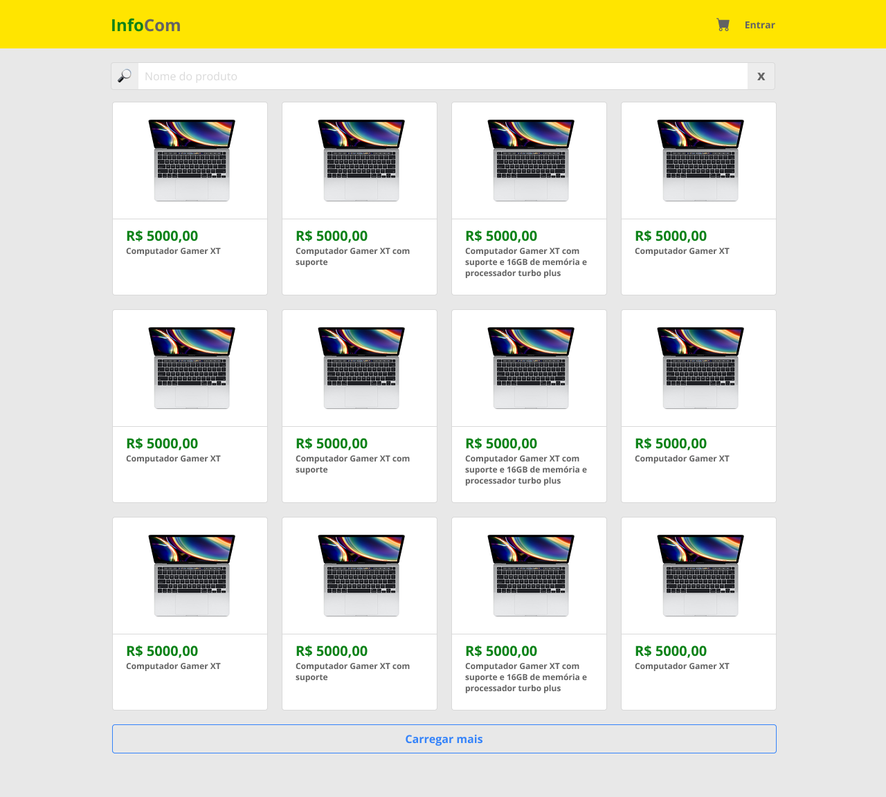

# Roteiro de Prática 02: Projeto Final InfoCom – Catálogo de Produtos com React

**Objetivo da prática:** Evoluir o projeto iniciado na prática 01 implementando uma funcionalidade de **busca de produtos em tempo real por nome**, **refatoração do código usando módulo e hooks personalizados** e **barra de navegação superior**.

Ao final da prática, o projeto deverá exibir a barra de navegação superior, o campo de busca no cabeçalho e filtrar produtos à medida que o usuário digita, como no protótipo:



---

### 📄 Versão Alvo da Interface (conforme design final)

🔸 Campo de busca superior
🔸 Lista de produtos filtrada dinamicamente
🔸 Código mais organizado com *hooks + components*
🔸 Barra de navegação superior

---

## 1. Estruturação inicial da prática (reforço do projeto)

No projeto criado na prática 01 (`infocom-react`), organizar a estrutura para evolução:

📁 Dentro de `src/`

```
src/
 ├── components/
 ├── hooks/            ← NOVO
 ├── pages/            ← futura expansão, mas iniciar hoje
 ├── App.jsx
 └── main.jsx
```

> Essa estrutura prepara o projeto para crescimento e mantém o código mais limpo.

---

## 2. Implementação da funcionalidade de **busca de produtos**

### 2.1 Criar componente `<SearchBar />`

📌 Criar em `src/components/SearchBar.jsx`:

```jsx
import './SearchBar.css'

function SearchBar({ value, onChange }) {
  return (
    <div className="search-bar">
      <input
        type="text"
        placeholder="Nome do produto"
        value={value}
        onChange={(e) => onChange(e.target.value)}
      />
      {value && <button onClick={() => onChange('')}>X</button>}
    </div>
  )
}

export default SearchBar;
```

- Esse componente recebe `value` e `onChange` como props (propriedades react) para controle externo.
- O botão "X" limpa o campo quando há texto.
- O `input` dispara `onChange` sempre que o usuário digita. Seu valor é controlado por `value`.
    > 📝 hamamos isso de **input controlado (_controlled input_)**.
- A prop `onChange` define uma função para atualizar o valor. 
  - Essa função será passada de fora, pois deve ser implementada no componente pai (pois é este que sabe como atualizar o estado referente a lista de produtos).

📌 Estilo inicial – `src/components/SearchBar.css`:

```css
.search-bar {
  display: flex;
  align-items: center;
  width: 100%;
  max-width: 800px;
  padding: 0 .5rem;
  margin: 1rem auto 2rem;
  background: #fff;
  border-radius: 6px;
  border: 1px solid #ccc;
  position: relative;
}

.search-bar input {
  flex: 1;
  border: none;
  padding: .8rem;
  font-size: .9rem;
}

.search-bar input:focus {
  outline: none;
}

.search-bar button {
  background: transparent;
  border: none;
  padding: .8rem 1rem;
  cursor: pointer;
  font-weight: bold;
  height: 100%;
  border-radius: 6px;
  transition: all 0.3s ease;
  position: absolute;
  right: 0;
}

.search-bar button:hover {
  background: #dc3545;
  color: #ffebee;
}
```

- Basicamente um campo de texto com um botão ao lado. Esses estilos, resumidamente:
  - Centralizam o componente na tela
  - Definem bordas arredondadas e cores neutras
  - Estilizam o campo de texto e o botão para melhor usabilidade

---

## 3. Criar um **hook personalizado** para busca e filtragem

> 📝 No React, um *hook* é uma função especial que permite "ligar" recursos do React (como estado e ciclo de vida) a componentes funcionais. **Um *hook personalizado* é um hook criado por você para encapsular lógica reutilizável.**

📄 Criar `src/hooks/useSearch.js`

```jsx
import { useState, useMemo } from "react";

export function useSearch(products) {
  const [query, setQuery] = useState("");

  // Filtragem com memoização (otimização)
  const filtered = useMemo(() => {
    if (!query) return products;
    return products.filter(p =>
      p.title.toLowerCase().includes(query.toLowerCase())
    );
  }, [products, query]);

  return { query, setQuery, filtered };
}
```

✔ Esse hook permite limpar o `App.jsx` e reutilizar lógica no futuro.

- `useState` gerencia o estado da consulta de busca (`query`).
- `useMemo` otimiza a filtragem, recalculando apenas quando `products` ou `query` mudam.
- A função `filtered` retorna a lista de produtos filtrada com base na consulta.

> 📝 **Memoização** é uma técnica para otimizar desempenho, armazenando resultados de funções para evitar cálculos repetidos. Ela funciona da seguinte forma: 
> - Quando a função é chamada, verifica se os argumentos já foram usados antes. 
> - Se sim, retorna o resultado armazenado.
> - Se não, executa a função, armazena o resultado e retorna esse novo valor.

---

## 4. Integrar a busca ao projeto

No **App.jsx**, importar hook e o componente:

```jsx
import SearchBar from "./components/SearchBar";
import { useSearch } from "./hooks/useSearch";
```

E substituir onde produtos são renderizados:

```jsx
function App() {
  // ... código existente
  const { query, setQuery, filtered } = useSearch(products);

  return (
    <main>
      { /*... código existente */ }
      {products && (
        <>
          <SearchBar value={query} onChange={setQuery} />
          <ProductList products={filtered.slice(0, visibleCount)} />

          <Button
            onClick={handleLoadMore}
            disabled={visibleCount >= filtered.length}
          >
            {visibleCount >= filtered.length
              ? "Fim dos produtos"
              : "Carregar Mais"}
          </Button>
        </>
      )}
    </main>
  );
}
```

- O campo de busca é renderizado acima da lista de produtos.
- Perceba que `ProductList` agora recebe `filtered` em vez de `products`.
- O estado `query` e a função `setQuery` são passados para o componente `SearchBar`. Assim, o campo de busca pode atualizar o estado do `App.jsx`.
- O elemento Button de carregar mais permanece funcional, agora considerando a lista filtrada (`filtered` ao invés de `products`).

---

## 5. Implementação da barra de navegação superior

Neste momento, vamos implementar o cabeçalho fixo do sistema com marca InfoCom, botão de login e ícone de carrinho, conforme design final.

> 🚨 Antes de prosseguir, instale a biblioteca `react-icons` para usar ícones prontos e estilizados.
> - No terminal, dentro da pasta do projeto, rode:
>   ```bash
>   npm install react-icons
>   ```

📌 Criar componente `src/components/Navbar.jsx`:

```jsx
import { FaShoppingCart } from "react-icons/fa";
import './Navbar.css';

export default function Navbar() {
  return (
    <header className="navbar">
      <h1 className="logo">
        <a href="/"><span>Info</span>Com</a>
      </h1>

      <nav>
        <button className="cart-btn">
          <FaShoppingCart size={20} />
        </button>

        <button className="login-btn">
          Entrar
        </button>
      </nav>
    </header>
  );
}
```

📌 Estilo inicial – `src/components/Navbar.css`:

```css
.navbar {
  width: 100%;
  background: #ffeb00;
  display: flex;
  justify-content: space-between;
  align-items: center;
  padding: 0.8rem 2rem;
  position: sticky; /* acompanha o scroll e fica fixo no topo */
  top: 0;
  z-index: 10; /* fica acima de outros elementos */
  box-shadow: 0 2px 4px -2px rgba(0, 0, 0, 0.1);
}

.logo {
  color: #636363;
  font-size: 1.5rem;
  font-weight: 700;

  & a {
    text-decoration: none;
    color: inherit;
  }

  & span {
    color: #0C8218;
  }
}

nav {
  display: flex;
  align-items: center;
  gap: 1rem;
}

.login-btn,
.cart-btn {
  background: transparent;
  border: none;
  font-size: 0.95rem;
  font-weight: bold;
  cursor: pointer;
  color: #636363;
}
```

📌 Integrar `Navbar` no `App.jsx`:

```jsx
import Navbar from "./components/Navbar";
// ... outras importações

// código existente

function App() {
  // ... código existente

  return (
    <>
      <Navbar />
      <main>
        { /*... código existente */ }
      </main>
    </>
  );
}
```

- Perceba que o `Navbar` é renderizado fora do `<main>`, garantindo que fique fixo no topo da página.
- Para isso, precisamos envolver tudo em um fragmento (_react fragment_) (`<>...</>`).
    > 📝 Um _react fragment_ é uma forma de agrupar múltiplos elementos sem adicionar nós extras ao DOM. É necessário pois o retorno de um componente React deve conter um único elemento pai.

---

## 6. Estilização final e ajustes

Vamos ajustar os estilos para que a interface fique próxima ao design final.

📌 Ajustes no `src/index.css`:

```css
/* MUDOU AQUI */
* {
  box-sizing: border-box;
}

/* MUDOU AQUI */
body {
  margin: 0;
  font-family: sans-serif;
  background: #f5f5f5;
  display: flex;
  justify-content: center;
}

#root {
    display: flex;
    flex-direction: column;
    align-items: center;
    width: 100%;
}
```

- Aqui ajustamos o `body` para retirar o padding aplicado anteriormente e adicionamos um ajuste de dimensionamento dos elementos com `box-sizing: border-box;`.

📌 Ajustes no `src/app.css`:

```css
main {
    width: 100%;
    max-width: 1200px;
    padding: 0px 2rem; /* MUDOU AQUI */
}

.error {
  color: #c0392b;
  text-align: center;
  margin: 2rem 0;
}
```

- Ajustamos o `main` para ter um padding lateral, evitando que os elementos encostem nas bordas da tela.

---

## 7. Checklist de conclusão da prática

| Item                                               | OK |
| -------------------------------------------------- | -- |
| Função de busca funcionando em tempo real          | ☐  |
| Campo de pesquisa com botão de limpar              | ☐  |
| Código refatorado usando hook `useSearch`          | ☐  |
| Projeto organizado em *pages / components / hooks* | ☐  |
| Interface próxima ao design final                  | ☐  |

---

## 8. Entrega

📌 Repositório atualizado no GitHub contendo:

✔ Commits descritivos da prática (pelo menos 2)   
✔ Hook e componentes criados   
✔ Busca funcionando + refatoração aplicada   
