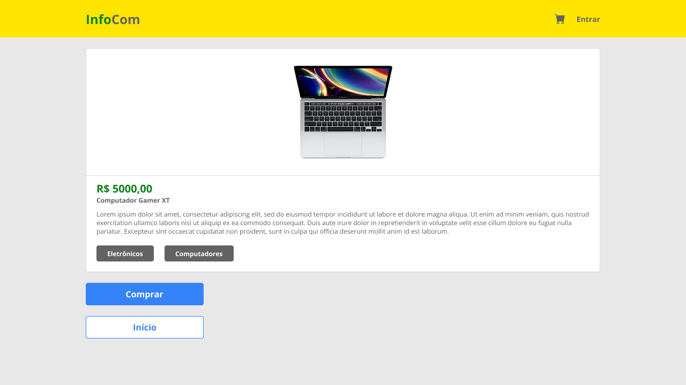

# Roteiro de Prática 03: Projeto Final InfoCom – Catálogo de Produtos com React

**Objetivo da prática:** Evoluir o projeto InfoCom construindo uma página de detalhes do produto, habilitando roteamento entre páginas com a biblioteca `react-router-dom` e extrair e organizar a lógica da página inicial para uma página home.

---

### 📄 Versão Alvo da Interface (conforme design final)

🔸 Página de detalhes do produto:



---

## 1. Estruturação inicial da prática (reforço do projeto)

No projeto criado na prática 01 (`infocom-react`), organizar a estrutura para evolução:

📁 Dentro de `src/`

```
src/
 ├── components/
 ├── hooks/
 ├── pages/            ← NOVO
 ├── App.jsx
 └── main.jsx
```

> Essa estrutura prepara o projeto para crescimento e mantém o código mais limpo.

---

## 2. Pequenos ajustes de estilo

> Primeiro, vamos ajustar alguns estilos CSS para melhorar a aparência da interface e aproximar do design final, compartilhado no [Figma](https://www.figma.com/design/imI9f8rVfuUeOkg7ci7LLq/Infonet-Commerce?node-id=0-1&t=qqk08GGArCvWJzg4-1&authuser=1).

- Queremos alcançar o seguinte estilo visual para o componente de card de produto:  
  

- Primeiro, vamos ajustar o componente `ProductCard.jsx` para incluir um elemento separador entre a imagem e o preço do produto e inverter a ordem do preço e do nome.

  ```jsx
  // Dentro do return do componente ProductCard
  <div className='card'>
    

    <div className='separator'></div>

    <div className='price'>R$ {product.price.toFixed(2).replace(".", ",")}</div>

    <h3>{product.title}</h3>
  </div>
  ```

- Agora, vamos modificar o CSS do componente, em `ProductCard.css`, para estilizar o card conforme o design:

  ```css
  .card {
    /* Estilos existentes */
    cursor: pointer;
  }

  .card:hover {
    box-shadow: 0 2px 6px rgba(0, 0, 0, 0.2);
  }

  /* Estilos existentes */

  .card h3 {
    font-size: 0.8rem;
    margin: 0.5rem 0;
    align-self: flex-start;
    color: #636363;
    font-weight: 600;
    line-height: 1.5;
  }

  .card .price {
    /* Estilos existentes */
    align-self: flex-start;
  }

  .separator {
    width: 100%;
    height: 1px;
    background-color: #ccc;
    margin: 1rem 0;
  }
  ```

  - Aqui adicionamos um efeito de hover ao card, ajustamos o tamanho e estilo do título, bem como alinhamos o preço e o nome à esquerda no card.
  - Também criamos uma linha separadora entre a imagem e o preço.

---

## 3. Habilitando roteamento entre páginas com `react-router-dom`

> Teremos agora duas páginas em nossa aplicação: a página inicial (home) com a lista de produtos e a página de detalhes do produto. A ideia é levar o usuário para a página de detalhes ao clicar em um card de produto.

1. Primeiro, instale a biblioteca `react-router-dom`:

   ```bash
   npm install react-router-dom
   ```

2. Em `main.jsx`, configure o roteamento básico:

```jsx
// Código existente
import { createBrowserRouter, RouterProvider } from "react-router-dom";

const router = createBrowserRouter([
  {
    path: "/",
    element: <App />,
  },
]);

createRoot(document.getElementById("root")).render(
  <StrictMode>
    <RouterProvider router={router} />
  </StrictMode>
);
```

- **Explicação:**
  - Importamos `createBrowserRouter` e `RouterProvider` para configurar o roteamento.
  - Criamos um roteador com a rota raiz (`/`) que renderiza o componente `App`.
  - Envolvemos a aplicação com `RouterProvider` para habilitar o roteamento.

---

## 4. Criando a página Home e isolando lógica de busca de produtos

> Aqui, vamos criar uma nova página chamada `Home` para exibir a lista de produtos e isolar a lógica de busca em um hook personalizado.

1. Crie um hook personalizado `useProducts.js` em `src/hooks/`:

```js
import { useEffect, useState } from "react";

export function useProducts() {
  const [products, setProducts] = useState(null);
  const [loading, setLoading] = useState(true);
  const [error, setError] = useState(null);

  useEffect(() => {
    fetch("https://fakestoreapi.com/products")
      .then((res) => res.json())
      .then(setProducts)
      .catch(() => setError("Erro ao carregar produtos."))
      .finally(() => setLoading(false));
  }, []);

  return { products, loading, error };
}
```

- Esse hook encapsula a lógica de busca dos produtos, retornando o estado dos produtos, carregamento e erro.
- Veja que é basicamente a mesma lógica que estava no `App.jsx`, mas agora isolada em um hook reutilizável (pode ser usado em qualquer outro componente).

2. Crie o componente `Home.jsx` em `src/pages/` e mova a lógica e estrutura da página inicial para lá:

```jsx
import { useState } from "react";
import ProductList from "./../components/ProductList";
import Button from "./../components/Button";
import SearchBar from "./../components/SearchBar";
import { useSearch } from "./../hooks/useSearch";
import { useProducts } from "./../hooks/useProducts";

const ITEMS_PER_PAGE = 8; // mostra 8 itens por vez

function Home() {
  const { products, loading, error } = useProducts(); // usa o hook personalizado
  const [visibleCount, setVisible] = useState(ITEMS_PER_PAGE); // quantos estão visíveis
  const { query, setQuery, filtered } = useSearch(products); // usa o hook de busca

  const handleLoadMore = () => {
    setVisible((prev) => prev + ITEMS_PER_PAGE);
  };

  return (
    <>
      {loading && <p>Carregando produtos...</p>}

      {error && <div className='error'>{error}</div>}

      {products && (
        <>
          <SearchBar value={query} onChange={setQuery} />
          <ProductList products={filtered.slice(0, visibleCount)} />

          <Button
            onClick={handleLoadMore}
            disabled={visibleCount >= filtered.length}
          >
            {visibleCount >= filtered.length
              ? "Fim dos produtos"
              : "Carregar Mais"}
          </Button>
        </>
      )}
    </>
  );
}

export default Home;
```

- O código ficou grande 😅, mas entenda que simplesmente movemos a lógica para um hook e um componente separados para melhor organização e reutilização.

3. Agora que movemos a lógica e estrutura da página inicial para o componente `Home`, vamos limpar o `App.jsx` para apenas renderizar a página atual que o usuário está visitando:

- **Código atualizado do `App.jsx`:**

```jsx
import Navbar from "./components/NavBar";
import "./App.css";
import { Outlet } from "react-router-dom";

function App() {
  return (
    <>
      <Navbar />
      <main>
        <Outlet />
      </main>
    </>
  );
}

export default App;
```

- O componente `Outlet` é um espaço reservado onde a página atual será renderizada, dependendo da rota visitada. Ele é fornecido pelo `react-router-dom`.

4. Finalmente, atualize o roteador em `main.jsx` para incluir a rota da página Home:

```jsx
// Código existente
import Home from "./pages/Home.jsx"; // importação da página Home

const router = createBrowserRouter([
  {
    path: "/",
    element: <App />,
    children: [
      {
        index: true,
        element: <Home />,
      },
    ],
  },
]);

// Resto do código permanece o mesmo
```

- Aqui adicionamos a rota filha (`children`) para a página Home, que será renderizada dentro do `Outlet` do `App.jsx`.
- O `index: true` indica que essa é a rota padrão para o caminho `/`.
- O que estiver atribuído ao `element` da rota filha será renderizado dentro do `Outlet` do componente pai (`App`).

---

## 5. Criando a página de detalhes do produto

> Agora, vamos criar a página de detalhes do produto que será exibida quando o usuário clicar em um card de produto.

1. Crie o componente `ProductDetails.jsx` em `src/pages/`:

```jsx
import { useParams } from "react-router-dom";

function ProductDetails() {
  const { id } = useParams();

  return (
    <div className='product-details'>
      <h2>Detalhes do Produto {id}</h2>
      {/* Aqui você pode buscar e exibir os detalhes do produto usando o id */}
    </div>
  );
}

export default ProductDetails;
```

- Usamos o hook `useParams` para acessar o parâmetro `productId` da URL.
- A ideia é que ao clicar em um card de produto, o usuário seja levado para uma URL como `/products/1`, onde `1` é o ID do produto.
- Com o ID em mãos, você pode buscar os detalhes do produto e exibi-los.

2. Atualize o roteador em `main.jsx` para incluir a rota da página de detalhes do produto:

```jsx
// Código existente
import ProductDetails from "./pages/ProductDetails.jsx"; // importação da página de detalhes

const router = createBrowserRouter([
  {
    path: "/",
    element: <App />,
    children: [
      {
        index: true,
        element: <Home />,
      },
      {
        path: "products/:id",
        element: <ProductDetails />,
      },
    ],
  },
]);
// Resto do código permanece o mesmo
```

- Aqui adicionamos uma nova rota filha para a página de detalhes do produto, onde `:id` é um parâmetro dinâmico que representa o ID do produto.
- Essa rota será acessada quando o usuário clicar em um card de produto, levando ele a URL correspondente (`/products/1`, por exemplo).

3. Atualize o componente `ProductCard.jsx` para navegar para a página de detalhes ao clicar no card:

```jsx
// Código existente
import { useNavigate } from "react-router-dom";

function ProductCard({ product }) {
  const navigate = useNavigate();

  const handleClick = () => {
    navigate(`/products/${product.id}`);
  };

  return (
    <div className='card' onClick={handleClick}>
      {/* Resto do código do card continua igual */}
    </div>
  );
}
```

- Usamos o hook `useNavigate` para obter a função de navegação.
- Ao clicar no card, chamamos `navigate` com a URL da página de detalhes do produto, passando o ID do produto.
- Perceba que adicionamos o `onClick` no `div` do card para chamar a função de navegação quando o card é clicado.

> Experimente clicar em um card de produto na página inicial. Você deve ser levado para a página de detalhes do produto, onde o ID do produto é exibido.

---

## 6. Implementando a página de detalhes do produto

> Agora, vamos implementar a lógica para buscar e exibir os detalhes do produto na página `ProductDetails`.

1. Primeiro, vamos atualizar o hook `useProducts.js` para permitir buscar um produto específico por ID:

```js
// Código existente

export function useProduct(id) {
  const [product, setProduct] = useState(null);
  const [loading, setLoading] = useState(true);
  const [error, setError] = useState(null);

  useEffect(() => {
    fetch(`https://fakestoreapi.com/products/${id}`)
      .then((res) => res.json())
      .then(setProduct)
      .catch(() => setError("Erro ao carregar detalhes do produto."))
      .finally(() => setLoading(false));
  }, [id]);

  return { product, loading, error };
}
```

- Esse novo hook `useProduct` encapsula a lógica de busca de um produto específico pelo ID.
- Ele retorna o estado do produto, carregamento e erro.

2. Atualize o componente `ProductDetails.jsx` para buscar os detalhes do produto usando o ID da URL:

```jsx
import { Link, useParams } from "react-router-dom";
import { useProduct } from "../hooks/useProducts";
import ProductCard from "../components/ProductCard";
import "./ProductDetails.css";
import Button from "../components/Button";

function ProductDetails() {
  const { id } = useParams();
  const { product, loading, error } = useProduct(id);

  if (loading) return <p>Carregando detalhes do produto...</p>;
  if (error) return <div className='error'>{error}</div>;
  if (!product) return <p>Produto não encontrado.</p>;

  return (
    <div className='product-details'>
      <ProductCard product={product} detailedView={true} />
      <Button>Comprar</Button>
      <Link to='/'>
        <Button variant='secondary'>Início</Button>
      </Link>
    </div>
  );
}

export default ProductDetails;
```

- Aqui usamos o hook `useProduct` para buscar os detalhes do produto com base no ID obtido da URL.
- Adicionamos tratamento para os estados de carregamento, erro e produto não encontrado.
- Exibimos os detalhes do produto utilizando o componente `ProductCard` que já criamos anteriormente.
- Adicionamos um botão "Comprar" e um link para voltar à página inicial.
  - O link usa o componente `Link` do `react-router-dom` para navegar de volta à página inicial sem recarregar a página.

> 🚨 **_Importante_**
>
> - Perceba que passamos uma prop `detailedView` para o componente `ProductCard`. Isso nos permitirá ajustar o estilo do card quando exibido na página de detalhes.
> - Também passamos uma prop `variant="secondary"` para o botão "Início" para diferenciá-lo visualmente do botão "Comprar".

3. Vamos atualizar o componente `ProductCard.jsx` para melhorar a exibição na página de detalhes:

```jsx
// Código existente

function ProductCard({ product, detailedView = false }) {
  const navigate = useNavigate();

  const handleClick = () => {
    // Só navega se não estivermos na página de detalhes
    if (!detailedView) {
      navigate(`/products/${product.id}`);
    }
  };

  return (
    <div className='card' onClick={handleClick}>
      {/* Código existente */}

      {detailedView && (
        <>
          <p className='product-description'>{product.description}</p>

          <span className='product-category'>{product.category}</span>
        </>
      )}
    </div>
  );
}
```

- Adicionamos uma prop opcional `detailedView` para ajustar o estilo do card quando exibido na página de detalhes.
- A descrição e a categoria do produto são exibidas apenas quando `detailedView` é verdadeiro.

4. Vamos atualizar também o componente `Button.jsx` para suportar o estilo secundário:

```jsx
import "./Button.css";

function Button({ children, variant, ...props }) {
  let className = "btn-default ";

  if (variant === "secondary") {
    className += "btn-secondary ";
  }

  return (
    <button className={className} {...props}>
      {children}
    </button>
  );
}

export default Button;
```

- Adicionamos uma prop `variant` para permitir diferentes estilos de botão.
- Se `variant` for `"secondary"`, aplicamos uma classe CSS diferente para estilizar o botão como secundário.

5. Faremos agora alguns ajustes no CSS para melhorar a aparência da página de detalhes e do botão secundário.

- Crie e/ou atualize o CSS do componente `ProductDetails.css`:

  ```css
  .product-details {
    display: flex;
    flex-direction: column;
    margin: 2rem auto;
    max-width: 800px;
    gap: 1rem;
  }

  .product-details .card {
    cursor: default; /* Remove o cursor pointer para o card na página de detalhes */
  }

  .product-details img {
    max-width: 200px;
    height: auto;
  }

  .product-details .price {
    font-size: 1.5rem;
    margin: 0.5rem 0;
  }

  .product-details h3 {
    font-size: 1rem;
    font-weight: 600;
  }

  .product-details .product-description {
    font-size: 0.8rem;
    color: #666;
    line-height: 1.4;
    margin: 0.5rem 0;
    align-self: flex-start;
  }

  /* Estilo para a categoria do produto, em formato de badge */
  .product-details .product-category {
    font-size: 0.75rem;
    background-color: #888;
    color: #fff;
    margin-top: 0.5rem;
    padding: 0.25rem 0.5rem;
    border-radius: 4px;
    display: inline-block;
    align-self: flex-start;
  }

  .product-details button {
    margin: 0;
    width: 200px;
  }

  .product-details a {
    text-decoration: none;
  }
  ```

- Atualize o CSS do componente `Button.css` para suportar o estilo secundário:

  ```css
  /* Estilos existentes */

  .btn-secondary {
    background-color: #fff;
    color: #3498db;
    border: 1px solid #3498db;
  }

  .btn-secondary:hover {
    background-color: #ecf0f1;
  }
  ```

---

## 7. Checklist de conclusão da prática

| Item                                                                | OK  |
| ------------------------------------------------------------------- | --- |
| Estruturação inicial do projeto                                     | ☐   |
| Ajustes de estilo no card de produto                                | ☐   |
| Configuração do roteamento com `react-router-dom`                   | ☐   |
| Criação da página Home                                              | ☐   |
| Criação da página de detalhes do produto                            | ☐   |
| Implementação da lógica de busca e exibição dos detalhes do produto | ☐   |
| Ajustes finais de estilo na página de detalhes e botões             | ☐   |
| Testes finais e validação do funcionamento                          | ☐   |

> Verifique o comportamento da aplicação, garantindo que a navegação entre páginas funcione corretamente e que os detalhes do produto sejam exibidos conforme esperado.

---

## 8. Entrega

📌 Repositório atualizado no GitHub contendo:

✔ Commits descritivos da prática (pelo menos 3 para esta prática)  
✔ Hooks e páginas criadas conforme o roteiro  
✔ Rotemento funcionando corretamente  
✔ Página de detalhes do produto implementada
