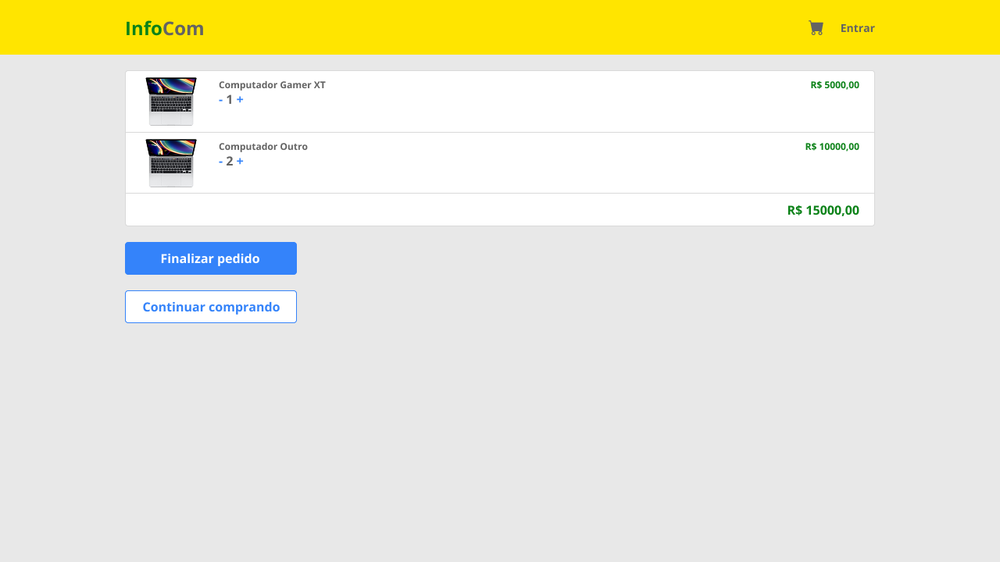

# Roteiro de Prática 04: Projeto InfoCom – Carrinho de Compras com Estado Global

**Objetivo da prática:**
Implementar a página de carrinho de compras e a **gestão global** do carrinho (adicionar/remover produtos, atualizar quantidades, totalizar valores) integrando com a Navbar e com as páginas já existentes (Home e Detalhes do Produto).

Ao final da prática, o projeto deverá:

* Ter um **estado global de carrinho** acessível em qualquer página.
* Permitir **adicionar produtos** ao carrinho a partir da Home e da página de detalhes.
* Exibir a página **/cart** com layout próximo ao protótipo.
* Mostrar o **badge de quantidade** de itens no ícone de carrinho da Navbar.
* Calcular e exibir o **total do pedido**.

---

## 0. Versão alvo da interface do carrinho

Layout esperado para esta prática (aproximado ao Figma):



🔹 Lista de itens com imagem, nome, controle de quantidade `- 1 +`  
🔹 Subtotal de cada produto alinhado à direita em verde   
🔹 Total geral em destaque no rodapé da lista   
🔹 Botões “Finalizar pedido” e “Continuar comprando”    

---

## 1. Preparar o estado global do carrinho (Context + Reducer)

### 1.1. Criar pasta de contexto

Crie a pasta `src/contexts` e os arquivos:

```text
src/contexts/cartReducer.js
src/contexts/CartContext.jsx
```

### 1.2. Definir forma do estado

* O carrinho será um array de itens:

  * Cada item possui:

    * `id`: id do produto
    * `product`: o próprio objeto de produto retornado da API
    * `quantity`: quantidade no carrinho


### 1.3. Implementar o `cartReducer`

No arquivo `src/contexts/cartReducer.js`, implemente:

```jsx
const initialState = {
  items: [], // [{ id, product, quantity }]
};

function cartReducer(state, action) {
  switch (action.type) {
    case "ADD_ITEM": {
      const { product, quantity } = action.payload;

      const existing = state.items.find((item) => item.id === product.id);

      if (!existing) {
        // se não existe, adiciona novo item
        return {
          ...state,
          items: [...state.items, { id: product.id, product, quantity }],
        };
      }

      // se já existe, apenas incrementa a quantidade
      return {
        ...state,
        items: state.items.map((item) =>
          item.id === product.id
            ? { ...item, quantity: item.quantity + quantity }
            : item
        ),
      };
    }

    case "REMOVE_ITEM": {
      const id = action.payload;
      // remove o item pelo id
      return {
        ...state,
        items: state.items.filter((item) => item.id !== id),
      };
    }

    case "UPDATE_QTY": {
      const { id, quantity } = action.payload;

      // se quantidade <= 0, remove o item
      if (quantity <= 0) {
        return {
          ...state,
          items: state.items.filter((item) => item.id !== id),
        };
      }

      // atualiza a quantidade do item
      return {
        ...state,
        items: state.items.map((item) =>
          item.id === id ? { ...item, quantity } : item
        ),
      };
    }

    // se a ação for limpar o carrinho, retorna o estado inicial (vazio)
    case "CLEAR":
      return initialState;

    // qualquer outra ação, retorna o estado atual
    default:
      return state;
  }
}

export { initialState, cartReducer };
```

> 💡 **Por que `useReducer`?**
> Porque o carrinho tem várias ações (adicionar, remover, atualizar), e um reducer organiza essa lógica em um só lugar, deixando seu código mais previsível e fácil de testar.

- Reducer é um padrão para gerenciar estados complexos com múltiplas ações.
- Aqui definimos ações para adicionar, remover, atualizar quantidade e limpar o carrinho.
- Cada ação retorna um novo estado baseado no estado atual e na ação recebida.
- Ao final exportamos o `initialState` e o `cartReducer` para uso no contexto que será compartilhado globalmente na nossa aplicação.

### 1.4. Implementar o `CartContext`

No arquivo `src/contexts/CartContext.jsx`, implemente:

```jsx
import { createContext, useReducer } from "react";
import { cartReducer, initialState } from "./cartReducer";

const CartContext = createContext();

function CartProvider({ children }) {
  const [state, dispatch] = useReducer(cartReducer, initialState);

  const totalItems = state.items.reduce(
    (sum, item) => sum + item.quantity,
    0
  );

  const totalPrice = state.items.reduce(
    (sum, item) => sum + item.quantity * item.product.price,
    0
  );

  function addItem(product, quantity = 1) {
    dispatch({ type: "ADD_ITEM", payload: { product, quantity } });
  }

  function removeItem(id) {
    dispatch({ type: "REMOVE_ITEM", payload: id });
  }

  function updateQuantity(id, quantity) {
    dispatch({ type: "UPDATE_QTY", payload: { id, quantity } });
  }

  function clearCart() {
    dispatch({ type: "CLEAR" });
  }

  const value = {
    items: state.items,
    totalItems,
    totalPrice,
    addItem,
    removeItem,
    updateQuantity,
    clearCart,
  };

  return <CartContext.Provider value={value}>{children}</CartContext.Provider>;
}

export { CartContext, CartProvider };
```

- Criamos o contexto `CartContext` usando `createContext()` do `Context API` do React.
- O `CartProvider` usa o `cartReducer`, criado anteriormente, para gerenciar o estado do carrinho.
- Definimos funções para adicionar, remover, atualizar quantidade e limpar o carrinho, que despacham ações para o reducer.
   - Exemplo: `addItem(product, quantity)` despacha a ação `ADD_ITEM` com o produto e quantidade.
- Calculamos `totalItems` e `totalPrice` com base nos itens do carrinho.
- O valor do contexto (`value`) inclui o estado atual do carrinho e as funções para modificá-lo.

> 🎯 É esse valor que será acessível em qualquer componente que consumir o contexto, por isso vamos conseguir usar o carrinho em qualquer lugar da aplicação.

### 1.5. Criar o hook `useCart`

Para facilitar o consumo do contexto, crie o hook `useCart` no arquivo `src/hooks/useCart.js` (crie o arquivo):

```jsx
import { useContext } from "react";
import { CartContext } from "./../contexts/CartContext";

export function useCart() {
  const context = useContext(CartContext);
  if (!context) {
    throw new Error("useCart deve ser usado dentro de CartProvider");
  }
  return context;
}
```

- Esse hook encapsula o uso do `useContext` para acessar o `CartContext`.
- Ele também verifica se o contexto está disponível, lançando um erro se for usado fora do `CartProvider`.
- Assim, qualquer componente pode simplesmente chamar `useCart()` para obter acesso ao estado e às funções do carrinho.

## 1.6. Persistir o carrinho no `localStorage`

> 💡 Para melhorar a experiência do usuário, você pode persistir o estado do carrinho no `localStorage`, assim ele não se perde ao recarregar a página.
> - O `localStorage` é uma API do navegador que permite armazenar dados localmente no computador do usuário.

No arquivo `src/contexts/CartContext.jsx`, vamos:

- Importar também o `useEffect` do React.
- Criar uma função `initCartState` para carregar o estado inicial do `localStorage`, caso exista.
- Usar essa função como inicializador do `useReducer`.

```jsx
import { createContext, useReducer, useEffect } from "react";
// ...outras importações

const CartContext = createContext();

const CART_STORAGE_KEY = "infocom_cart"; // chave para o localStorage

// Função para inicializar o estado do carrinho a partir do localStorage
function initCartState() {
  try {
    const storedCart = localStorage.getItem(CART_STORAGE_KEY);

    // se não há nada armazenado, retorna o estado inicial vazio
    if (!storedCart) {
      return initialState;
    }

    // tenta converter o JSON de volta para o estado
    return JSON.parse(storedCart);
  } catch (error) {
    console.error("Erro ao carregar o carrinho do localStorage:", error);
    // em caso de erro, retorna o estado inicial vazio
    return initialState;
  }
}
```

Ainda dentro do `CartProvider`, ajuste o `useReducer` para usar o inicializador:

```jsx
// ANTES
const [state, dispatch] = useReducer(cartReducer, initialState);

// DEPOIS
const [state, dispatch] = useReducer(cartReducer, initialState, initCartState);
```

- Quando o `CartProvider` for montado, ele tentará carregar o estado do carrinho do `localStorage` usando a função `initCartState`.

Ainda dentro de `CartProvider`, logo depois da linha do `useReducer`, adicione um `useEffect` que sincroniza o estado com o localStorage:

```jsx
// sempre que o estado do carrinho mudar, salva no localStorage
useEffect(() => {
  try {
    localStorage.setItem(CART_STORAGE_KEY, JSON.stringify(state));
  } catch (error) {
    console.error("Erro ao salvar carrinho no localStorage:", error);
  }
}, [state]); // state no array de dependências

// ...restante do código do CartProvider permanece igual
```

---

## 2. Envolver a aplicação com o `CartProvider`

Agora precisamos garantir que **toda a aplicação** tenha acesso ao contexto do carrinho.

No arquivo `src/main.jsx`, envolva tudo com o `CartProvider`:

```jsx
// Importações existentes...
import { CartProvider } from "./contexts/CartContext";

// Código existente...

createRoot(document.getElementById("root")).render(
  <StrictMode>
    <CartProvider>
      <RouterProvider router={router} />
    </CartProvider>
  </StrictMode>
);
```

> ✅ A partir daqui, qualquer componente dentro da árvore de rotas pode usar `useCart()` para acessar e modificar o carrinho.

---

## 3. Utilitário para formatar preços

Para manter o código limpo e o formato de moeda padronizado, vamos criar um utilitário.

- Crie a pasta `src/utils` se ainda não existir e dentro dela o arquivo:

```text
src/utils/formatPrice.js
```

```jsx
export function formatPrice(value) {
  return value.toLocaleString("pt-BR", {
    style: "currency",
    currency: "BRL",
  });
}
```

> 🧽 Assim você evita repetir `toLocaleString` em todo lugar e, se precisar mudar o formato, altera em um só arquivo.

---

## 4. Criar a página de carrinho `/cart`

### 4.1. Nova página `Cart.jsx`

Crie o arquivo:

```text
src/pages/Cart.jsx
```

Implementação inicial:

```jsx
import { Link } from "react-router-dom";
import { useCart } from "./../hooks/useCart";
import { formatPrice } from "./../utils/formatPrice";
import Button from "./../components/Button";
import "./Cart.css";

export default function Cart() {
  const { items, totalItems, totalPrice, updateQuantity, removeItem } = useCart();

  // Verifica se há itens no carrinho
  const hasItems = items.length > 0;

  // Renderização da página com base no estado do carrinho
  return (
    <main className="cart-page">
      <h2>Carrinho de Compras</h2>

      { /** Se não houver itens, mostrar mensagem de carrinho vazio */ }
      {!hasItems && (
        <div className="cart-empty">
          <p>Seu carrinho está vazio.</p>
          <Link to='/'>
            <Button>Voltar para o catálogo</Button>
          </Link>
        </div>
      )}

      { /** Se houver itens, mostrar a lista de produtos no carrinho */ }
      {hasItems && (
        <>
          <section className="cart-list">
            {items.map((item) => (
              <article key={item.id} className="cart-item">
                <div className="cart-item-info">
                  

                  <div className="cart-item-details">
                    <h3>{item.product.title}</h3>

                    <div className="cart-qty">
                      <button
                        onClick={() =>
                          updateQuantity(item.id, item.quantity - 1)
                        }
                      >
                        -
                      </button>
                      <span>{item.quantity}</span>
                      <button
                        onClick={() =>
                          updateQuantity(item.id, item.quantity + 1)
                        }
                      >
                        +
                      </button>
                    </div>

                    <button
                      className="cart-remove"
                      onClick={() => removeItem(item.id)}
                    >
                      Remover
                    </button>
                  </div>
                </div>

                <div className="cart-item-price">
                  {formatPrice(item.product.price * item.quantity)}
                </div>
              </article>
            ))}
          </section>

          <section className="cart-summary">
            <div className="cart-summary-total">
              <span>Total ({totalItems} itens)</span>
              <strong>{formatPrice(totalPrice)}</strong>
            </div>

            <div className="cart-summary-actions">
              <Button
                className='btn-default'
                onClick={() => alert("Pedido finalizado (simulação)!")}
              >
                Finalizar pedido
              </Button>

              { /** Botão para continuar comprando, que leva de volta ao catálogo */ }
              <Link to='/' className="btn-default btn-secondary">
                Continuar comprando
              </Link>
            </div>
          </section>
        </>
      )}
    </main>
  );
}
```

- Aqui usamos o hook `useCart()` para acessar o estado do carrinho e as funções de modificação.
- A página verifica se há itens no carrinho e renderiza a lista de produtos ou uma mensagem de carrinho vazio.
- Cada item exibe a imagem, título, controle de quantidade e subtotal.
- O total geral é calculado e exibido no rodapé, junto com os botões de ação.
- Cada botão de quantidade chama `updateQuantity` para ajustar a quantidade, e o botão de remover chama `removeItem`.
- Ao final, temos uma simulação de finalização de pedido com um alerta.

### 4.2. Estilização da página de carrinho

Crie o arquivo `src/pages/Cart.css`:

```css
.cart-page {
  width: 100%;
  max-width: 1200px;
  margin: 2rem auto;
  padding: 0 2rem;
}

.cart-page h2 {
  margin-bottom: 1.5rem;
  font-size: 1.5rem;
}

.cart-empty {
  background: #fff;
  border-radius: 8px;
  padding: 2rem;
  text-align: center;
}

.cart-empty a {
  text-decoration: none;
}

.cart-list {
  background: #fff;
  border-radius: 8px;
  padding: 1rem 0;
  margin-bottom: 1rem;
}

.cart-item {
  display: flex;
  align-items: center;
  justify-content: space-between;
  padding: .75rem 1.5rem;
  border-bottom: 1px solid #eee;
}

.cart-item:last-child {
  border-bottom: none;
}

.cart-item-info {
  display: flex;
  gap: 1rem;
  align-items: center;
}

.cart-item img {
  width: 90px;
  height: 90px;
  object-fit: contain;
  border-radius: 4px;
  background: #f7f7f7;
}

.cart-item-details h3 {
  font-size: .95rem;
  margin-bottom: .5rem;
}

.cart-qty {
  display: inline-flex;
  align-items: center;
  gap: .5rem;
  margin-bottom: .25rem;
}

.cart-qty button {
  width: 28px;
  height: 28px;
  border-radius: 4px;
  border: none;
  background: #e3e7ff;
  cursor: pointer;
}

.cart-remove {
  border: none;
  background: transparent;
  color: #c0392b;
  font-size: .8rem;
  cursor: pointer;
}

.cart-item-price {
  min-width: 140px;
  text-align: right;
  font-weight: bold;
  color: #27ae60;
}

.cart-summary {
  display: flex;
  flex-direction: column;
  align-items: flex-end;
  gap: 1rem;
}

.cart-summary-total {
  display: flex;
  gap: 1rem;
  align-items: center;
  font-size: 1rem;
}

.cart-summary-total span {
  color: #555;
}

.cart-summary-total strong {
  color: #27ae60;
  font-size: 1.1rem;
}

.cart-summary-actions {
  display: flex;
  align-items: center;
  gap: 1rem;
}

.cart-summary-actions a {
  text-decoration: none;
}

```

> 😉 **Sugestão:** Ajuste livremente estilos para aproximar ainda mais do design fornecido, ou pode pensar em um estilo levemente diferente.

---

## 5. Registrar a rota `/cart` no roteador

No arquivo `src/main.jsx`, adicione a rota para a página do carrinho.

```jsx
// Importações existentes...
import Cart from "./pages/Cart";

const router = createBrowserRouter([
  {
    path: "/",
    element: <App />,
    children: [
      {
        index: true,
        element: <Home />,
      },
      {
        path: "products/:id",
        element: <ProductDetails />,
      },
      {
        path: "cart",
        element: <Cart />,
      },
    ],
  },
]);

// Código existente...
```

> ✅ Teste indo manualmente em `/cart` no navegador para ver se a página abre (mesmo sem itens ainda).

---

## 6. Adicionar produtos ao carrinho (Home e Detalhes)

### 6.1. Botão “Adicionar ao carrinho” na página de detalhes

Na página `ProductDetails` (por ex. `src/pages/ProductDetails.jsx`), use contexto do carrinho para adicionar o produto ao carrinho quando o botão for clicado.:

```jsx
// Importações existentes...
import { useCart } from "../contexts/CartContext";

export default function ProductDetails() {
  // Código existente

  const { addItem } = useCart(); // hook para acessar o contexto do carrinho

  // Código existente...

  return (
    <div className="product-details">
      <ProductCard product={product} detailedView />

      { /** Botão para adicionar ao carrinho */ }
      <Button onClick={() => addItem(product, 1)}>Comprar</Button>
      <Link to="/">
        <Button variant="secondary">Início</Button>
      </Link>
    </div>
  );
}

export default ProductDetails;
```

- Perceba que simplesmente usamos o hook `useCart` para acessar a função `addItem` do contexto do carrinho.
- Depois chamamos essa função a partir do clique no botão "Comprar".

> 🎯 **Desafio:**
> - Altere o componente ProductCard para que, ao ser exibido na página inicial, tenha um botão "Adicionar ao carrinho" que utilize o contexto do carrinho para adicionar o produto diretamente da página inicial.

---

## 7. Integrar a Navbar com o carrinho

Agora vamos fazer o ícone do carrinho mostrar a **quantidade total** e levar até a página `/cart`.

No componente `NavBar` (`src/components/NavBar.jsx`), ajuste:

```jsx
import { Link } from "react-router-dom";
import { FaShoppingCart } from "react-icons/fa";
import { useCart } from "../contexts/CartContext";
import "./Navbar.css";

export default function Navbar() {
  const { totalItems } = useCart();

  return (
    <header className="navbar">
      <h1 className="logo">
        <Link to="/">
          <span>Info</span>Com
        </Link>
      </h1>

      <nav>
        <Link to="/cart" className="cart-btn">
          <FaShoppingCart size={20} />
          {totalItems > 0 && (
            <span className="cart-badge">{totalItems}</span>
          )}
        </Link>

        <button className="login-btn">
          Entrar
        </button>
      </nav>
    </header>
  );
}
```

- Aqui as seguintes alterações foram feitas:
  - Importamos o hook `useCart` para acessar o estado do carrinho.
  - Extraímos `totalItems` do contexto para saber quantos itens estão no carrinho.
  - Adicionamos um badge que exibe `totalItems` ao lado do ícone do carrinho, mas somente se houver itens (condicional).
  - O link do ícone do carrinho agora leva para a rota `/cart`.
  - Também alteramos o link do logo para usar o componente `Link` do `react-router-dom`, ao invés de uma tag `<a>`.

No `Navbar.css`, adicione o estilo do badge:

```css
/** Código existente */

.cart-btn {
  position: relative;
  display: inline-flex;
  align-items: center;
  justify-content: center;
}

.cart-btn:link,
.cart-btn:visited {
  color: inherit;
}

.cart-badge {
  position: absolute;
  top: -6px;
  right: -10px;
  background: #e74c3c;
  color: #fff;
  border-radius: 999px;
  padding: 0 6px;
  font-size: .7rem;
  font-weight: bold;
}
```

> ✅ Agora o ícone de carrinho exibe o total de itens e leva direto para a página de carrinho.

---

## 8. Testes rápidos para validar a prática

Faça os seguintes testes no navegador:

1. **Adicionar produtos na Home**

   * Clique em “Adicionar ao carrinho” em 2 ou 3 produtos.
   * Verifique se o número do badge do carrinho aumenta.

2. **Adicionar pela página de detalhes**

   * Clique em “Ver detalhes” de um produto.
   * Na página de detalhes, clique em “Adicionar ao carrinho”.
   * Volte e verifique o badge.

3. **Abrir o carrinho**

   * Clique no ícone do carrinho na Navbar.
   * Verifique se os produtos aparecem com as quantidades corretas.

4. **Atualizar quantidades**

   * Use os botões `-` e `+` para alterar quantidades.
   * Verifique se o total geral é recalculado corretamente.
   * Quando a quantidade chegar em 0, o item deve desaparecer.

5. **Remover item**

   * Clique em “Remover” em um dos itens.
   * Verifique se o item some e se o total é atualizado.

6. **Carrinho vazio**

   * Remova todos os itens.
   * A página deve exibir a mensagem de carrinho vazio e o botão para voltar ao catálogo.

---

## 9. Checklist de conclusão da prática

| Item                                                            | OK |
| --------------------------------------------------------------- | -- |
| `CartContext` criado com `useReducer` e `useCart`               | ☐  |
| `CartProvider` envolveu a aplicação inteira                     | ☐  |
| Botões de “Adicionar ao carrinho” funcionando (Home + Detalhes) | ☐  |
| Página `/cart` criada e integrada ao roteador                   | ☐  |
| Layout do carrinho próximo ao design de referência              | ☐  |
| Badge no ícone do carrinho mostrando quantidade total           | ☐  |
| Total geral do pedido calculado e exibido corretamente          | ☐  |
| Comportamento de carrinho vazio implementado                    | ☐  |
| Carrinho é mantido ao recarregar a página (localStorage)          | ☐  |

---

## 10. Entrega

📌 **Repositório atualizado no GitHub**, contendo:

* Commits identificando claramente as alterações feitas (pelo menos três commits usando _conventional commits_).
* Novo contexto `CartContext` com `CartProvider` e `useCart`
* Página `/cart` implementada
* Navbar com badge do carrinho funcionando
